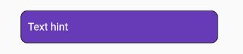

# Flutter_UI
This rep will save your time (maybe :3 )

Need more:
- more deeper dive into it
- I want learn more in flutter (ios compile and etc)
- cyber

# Container radius corner

```Radius with color border and backGround
Container(
      decoration: BoxDecoration(
          color: model.cardColor,
          border: Border.all(
            color: model.cardStroke,
          ),
          borderRadius: BorderRadius.all(Radius.circular(10))),
    )
```


# FlatButton radius corner

```
FlatButton(
    shape: RoundedRectangleBorder(
        borderRadius: BorderRadius.circular(18.0),
        side: BorderSide(color: Colors.black)
    ),
    color: Colors.deepPurple,
    onPressed: (){},
)
```

# TextField with controller


```
var controllerSearch = TextEditingController();
var nameOfWorkSpace = "";
void updateSearch(){
    nameOfWorkSpace = controllerSearch.text;
}

@override
  void initState() {
    controllerSearch.addListener(updateSearch);
    super.initState();
}

Container(
    decoration: BoxDecoration(
        borderRadius: BorderRadius.all(Radius.circular(10.0)),
        color: Colors.deepPurple,
        border: Border.all(color: Colors.black)
    ),
    child: Padding(
      padding: const EdgeInsets.only(left: 10),
      child: TextField(
        showCursor: true,
        controller: controllerSearch,
        style: TextStyle(color:  Colors.white),
        cursorColor: Colors.white,
        decoration: InputDecoration(
            border: InputBorder.none,
            hintText: "Text hint",
            hintStyle: TextStyle(color: Colors.white)
        ),
      ),
    ),
  )
```


# RxDart simple Example

```
// Rx File
import 'package:rxdart/rxdart.dart';

class RxListUpdate {
  int _noteClass;

  int get noteClass => _noteClass;

  RxListUpdate(this._noteClass){
    this.onListUpdater = BehaviorSubject<int>.seeded(noteClass);
  }
  BehaviorSubject<int> onListUpdater;

  Future onListUpdate(int newList) async {
    _noteClass = model.sortMap(newList);
    onListUpdater.add(_noteClass);
  }
}

// Main File

RxListUpdate listUpdate = RxListUpdate(map);

StreamBuilder<int>(
          stream: listUpdate.onListUpdater,
          builder: (buildContext, snapshot) {
            int list = snapshot.data;
            return ListView(
              children: ,
            );
          })
 ```
 
# SlidingUp panel

import 'package:sliding_up_panel/sliding_up_panel.dart'; //u can search it on web
```
PanelController _pc = new PanelController();
@override
  Widget build(BuildContext context) {
    return  Scaffold(
        body: 
            SlidingUpPanel(
              maxHeight: height - 140,
              controller: _pc,
              minHeight: 0,
              panel: someWidget(context),
            )

    );
  }

//and in some place of code smth like this:
onTap: () {
    setState(() {
      _pc.open();
    });
}

```


# FutureBuilder 
```
FutureBuilder(
          future: downloadData(),
          builder: (BuildContext context, AsyncSnapshot<String> snapshot){
                switch (snapshot.connectionState) {
                  case ConnectionState.none:
                    return new Text('Press button to start');
                  case ConnectionState.waiting:
                    return new Text('Awaiting result...');
                default:
                  if (snapshot.hasError)
                    return new Text('Error: ${snapshot.error}');
                  else
                    return new Text('Result: ${snapshot.data}');
            }
          }
        ),
```
